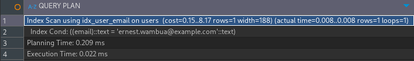
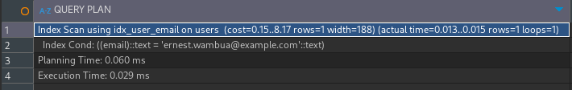

# Index Performance

## Query

```sql
EXPLAIN ANALYZE
SELECT * FROM users
WHERE email = 'brian@example.com';

CREATE INDEX idx_users_email ON users(email);

EXPLAIN ANALYZE
SELECT * FROM users
WHERE email = 'brian@example.com';
```

## Performance Analysis

**Without Index**



**With Index**

